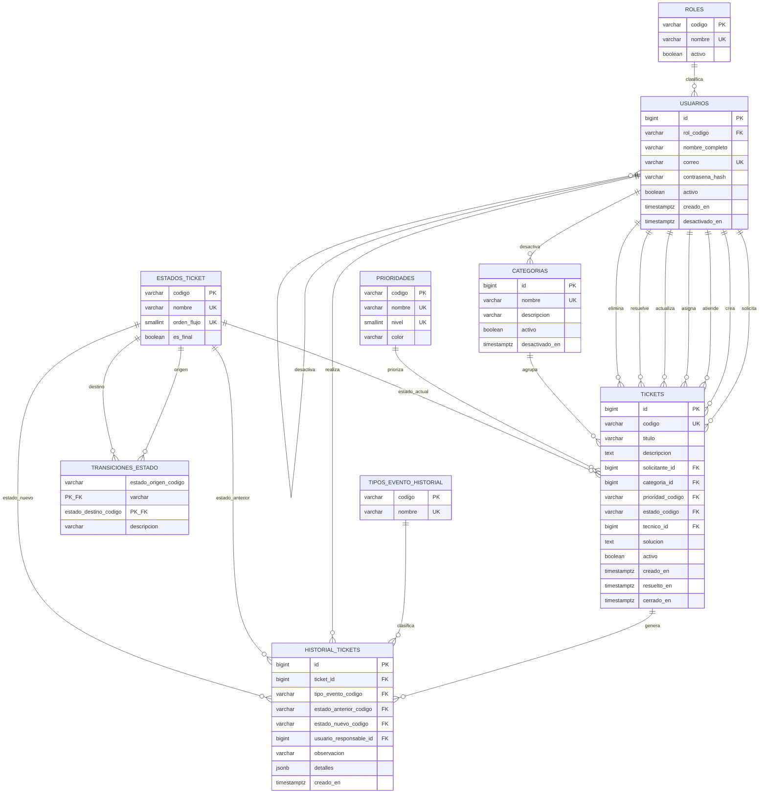

# Diagrama entidad–relación — HelpDesk TI

El modelo usa catálogos para roles, prioridades, estados y eventos. Los tickets no
se eliminan físicamente y cada acción importante genera un registro inmutable en
`historial_tickets`.

## Decisiones importantes

- Se usa `TIMESTAMPTZ` para conservar fechas correctas aunque cambie la zona
  horaria del servidor.
- Los identificadores internos son `BIGINT`; los códigos visibles son cadenas
  independientes y únicas.
- `ON DELETE RESTRICT` evita borrar información relacionada con el historial.
- `activo`, junto con las fechas y usuarios de desactivación, implementa la
  eliminación lógica.
- `transiciones_estado` permite cambiar el flujo sin modificar la estructura de
  la tabla `tickets`.
- Las vistas `vw_metricas_*` entregan al panel los indicadores solicitados.
