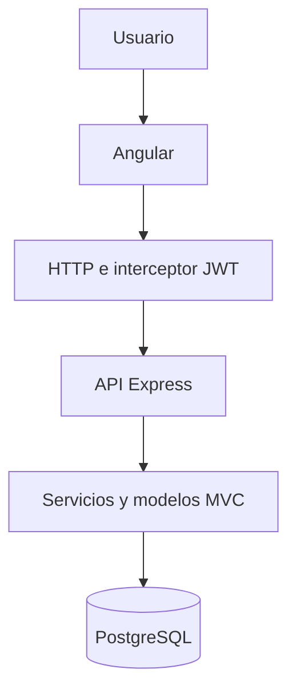

# Paso 10: Integración frontend y backend

**Estado:** COMPLETADO

**Fecha de finalización:** 1 de agosto de 2026

## Objetivo

Conectar la aplicación Angular con la API REST de HelpDesk TI e implementar
interfaces completas para autenticación, tickets, usuarios, categorías,
métricas y paneles personalizados según el rol del usuario.

## Resultado

El frontend dejó de ser una plantilla inicial y se convirtió en una
aplicación funcional conectada con Node.js, Express y PostgreSQL.

Los usuarios pueden iniciar sesión y ejecutar los flujos autorizados para su
rol desde una interfaz web responsive. Las solicitudes utilizan JWT y todos
los permisos vuelven a comprobarse en el backend.

## Arquitectura de integración



Angular funciona como capa de presentación y consume los endpoints de la API.
Express recibe las solicitudes, valida el token y los permisos, ejecuta las
reglas de negocio y consulta PostgreSQL mediante los modelos.

## Configuración HTTP

La integración utiliza:

- `provideHttpClient` para habilitar solicitudes HTTP;
- un interceptor funcional para agregar `Authorization: Bearer`;
- un proxy de desarrollo para redirigir `/api` a `localhost:3000`;
- servicios Angular separados por recurso;
- modelos TypeScript para tipar solicitudes y respuestas;
- manejo centralizado de errores HTTP;
- guards para proteger rutas privadas y administrativas.

## Autenticación

Se implementó:

- formulario de inicio de sesión;
- almacenamiento de la sesión autenticada;
- consulta del usuario actual;
- envío automático del JWT;
- recuperación de sesión al recargar el navegador;
- cierre de sesión;
- redirección al login cuando no existe autenticación;
- restricción de rutas de acuerdo con el rol.

## Servicios Angular implementados

| Servicio            | Responsabilidad                         |
| ------------------- | --------------------------------------- |
| `AuthService`       | Inicio, recuperación y cierre de sesión |
| `HealthService`     | Comprobación inicial de comunicación    |
| `UsersService`      | CRUD administrativo de usuarios         |
| `CategoriesService` | CRUD y consulta de categorías           |
| `CatalogsService`   | Roles, prioridades y estados            |
| `TicketsService`    | Operaciones completas de tickets        |
| `MetricsService`    | Panel administrativo de métricas        |

## Rutas principales

| Ruta                         | Roles              | Descripción                             |
| ---------------------------- | ------------------ | --------------------------------------- |
| `/login`                     | Público            | Inicio de sesión                        |
| `/inicio`                    | Todos              | Panel personalizado según el rol        |
| `/tickets`                   | Todos              | Listado autorizado y creación permitida |
| `/tickets/:id`               | Usuario autorizado | Detalle, edición e historial            |
| `/administracion/usuarios`   | Administrador      | CRUD visual de usuarios                 |
| `/administracion/categorias` | Administrador      | CRUD visual de categorías               |
| `/administracion/metricas`   | Administrador      | Métricas del HelpDesk                   |

## Panel principal por rol

### Administrador

El administrador visualiza:

- total de tickets;
- tickets pendientes;
- tickets críticos;
- tickets en proceso y resueltos;
- tickets recientes del sistema;
- accesos a usuarios, categorías y métricas.

### Técnico

El técnico visualiza:

- cantidad de tickets asignados;
- tickets en proceso;
- tickets resueltos y cerrados;
- sus asignaciones recientes;
- acceso al listado de trabajo autorizado.

### Solicitante

El solicitante visualiza:

- total de solicitudes propias;
- tickets pendientes;
- tickets en atención;
- tickets resueltos y cerrados;
- sus solicitudes recientes;
- acceso para crear un ticket.

## Gestión visual de tickets

La interfaz permite:

- listar tickets según el alcance del rol;
- buscar por código o título;
- filtrar por estado, prioridad y categoría;
- utilizar paginación;
- crear tickets;
- consultar el detalle;
- actualizar los datos permitidos;
- asignar, reasignar o retirar técnicos;
- realizar transiciones de estado;
- registrar una solución;
- consultar el historial cronológico;
- cerrar tickets;
- aplicar eliminación lógica.

## Administración visual

### Usuarios

El administrador puede:

- buscar usuarios por nombre o correo;
- filtrar por rol y estado;
- crear usuarios;
- editar información y roles;
- cambiar contraseñas;
- desactivar y reactivar cuentas;
- navegar mediante paginación.

### Categorías

El administrador puede:

- buscar categorías;
- filtrar activas e inactivas;
- crear categorías;
- actualizar nombre y descripción;
- desactivar y reactivar categorías;
- conservar referencias históricas.

## Métricas

El panel administrativo muestra:

- resumen total por estado;
- tickets por prioridad;
- tickets por categoría;
- carga actual por técnico;
- tickets finalizados por técnico;
- promedio de horas de resolución.

Los datos provienen de las vistas de PostgreSQL y se actualizan desde la API.

## Diseño y experiencia de usuario

Se implementaron:

- diseño responsive;
- navegación privada uniforme;
- formularios con validación visual;
- botones y campos personalizados;
- tablas responsive;
- badges para roles, estados y prioridades;
- mensajes de carga, éxito y error;
- estados vacíos;
- ventanas modales administrativas;
- panel de inicio orientado a tareas;
- historial mediante línea de tiempo;
- confirmaciones para acciones sensibles.

La información técnica de API, JWT y PostgreSQL se retiró del panel principal
porque corresponde a diagnóstico de desarrollo y no a una interfaz destinada
al usuario final.

## Seguridad

La integración conserva las medidas del backend:

1. Autenticación JWT.
2. Envío automático del token mediante interceptor.
3. Guards para rutas privadas y administrativas.
4. Comprobación de roles nuevamente en Express.
5. Validación de entradas en frontend y backend.
6. Contraseñas cifradas con bcrypt.
7. Consultas SQL parametrizadas.
8. Errores controlados.
9. Eliminación lógica.
10. Historial de acciones importantes.

Los guards mejoran la navegación, pero la seguridad real permanece en la API,
por lo que ocultar un botón no sustituye la autorización del backend.

## Pruebas realizadas

### Backend

```text
typecheck: aprobado
build: aprobado
tests: 35 de 35 aprobadas
```

### Frontend

```text
build de producción: aprobado
archivos de prueba: 2 aprobados
pruebas automatizadas: 6 de 6 aprobadas
```

### Flujos manuales

Se comprobaron 16 flujos relacionados con:

- autenticación;
- autorización por roles;
- usuarios;
- categorías;
- creación y actualización de tickets;
- asignación;
- cambios de estado;
- solución;
- historial;
- cierre;
- eliminación lógica;
- filtros;
- paginación;
- métricas;
- cierre de sesión.

Los resultados completos están disponibles en
[Paso 10: verificación de flujos](paso-10-verificacion-flujos.md).

## Relación con los requisitos

| Requisito | Integración realizada                |
| --------- | ------------------------------------ |
| RF-01     | Inicio de sesión desde Angular       |
| RF-02     | Sesión JWT y cierre de sesión        |
| RF-03     | Interfaces y rutas según el rol      |
| RF-04     | CRUD visual de usuarios              |
| RF-05     | CRUD visual de categorías            |
| RF-06     | Formulario de creación de tickets    |
| RF-07     | Listado limitado según el usuario    |
| RF-08     | Detalle e historial                  |
| RF-09     | Actualización permitida              |
| RF-10     | Eliminación lógica desde la interfaz |
| RF-11     | Asignación de técnicos               |
| RF-12     | Cambios de estado autorizados        |
| RF-13     | Registro y visualización de solución |
| RF-14     | Búsqueda, filtros y paginación       |
| RF-15     | Panel administrativo de métricas     |
| RNF-02    | Diseño responsive                    |
| RNF-06    | Validaciones visuales y de API       |
| RNF-07    | Guards y autorización del backend    |
| RNF-08    | Mensajes de error controlados        |
| RNF-10    | Historial visible                    |
| RNF-15    | Pruebas automatizadas                |
| RNF-18    | Desarrollo dividido en commits       |

## Commits del paso 10

1. `chore(frontend): configurar HTTP, proxy y modelos de API`
2. `feat(frontend): implementar login y estructura privada`
3. `feat(frontend): implementar servicios de usuarios, categorías, catálogos y tickets`
4. `feat(frontend): implementar listado, filtros y creación de tickets`
5. `feat(frontend): implementar detalle y actualización de tickets`
6. `feat(frontend): implementar asignación, estados, solución e historial`
7. `feat(frontend): implementar CRUD visual de usuarios y categorías`
8. `feat(frontend): implementar panel de métricas`
9. `feat(frontend): convertir inicio en panel dinámico por rol`
10. `test(frontend): verificar flujos completos del sistema`
11. `docs(frontend): documentar paso 10 y actualizar plan`

## Archivos principales

```text
frontend/src/app/
├── core/
│   ├── guards/
│   ├── interceptors/
│   ├── models/
│   └── services/
├── features/
│   ├── admin/
│   ├── auth/
│   ├── home/
│   └── tickets/
├── layout/
├── app.config.ts
└── app.routes.ts
```

## Conclusión

El paso 10 quedó completado con la integración funcional entre Angular y la
API REST. Los tres roles pueden ejecutar sus flujos desde una interfaz
responsive, mientras que JWT, los permisos del backend y PostgreSQL conservan
la seguridad, integridad y trazabilidad del sistema.

El proyecto queda preparado para el paso 11, correspondiente a la ejecución
formal del plan de pruebas y al registro detallado de sus resultados.
